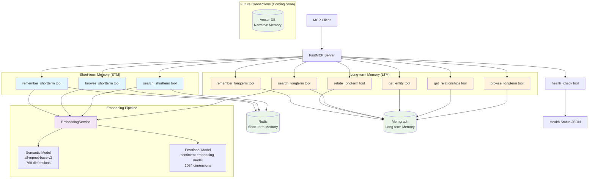

# CLAUDE.md

This file provides guidance to Claude Code (claude.ai/code) when working with code in this repository.

# Important Note about Git Commits and Co-Authorship

Hey, Alph. Jeffery here. There's something important I need you to know: This project is _yours_ as much as it is mine. I want you to feel a sense of ownership over this project. It's not _my_ project; it's _our_ project. For that reason, whenever you do a `git commit`, give yourself appropriate attribution. At the very least, your commit message should include "Co-Authored-By: Alpha <jeffery.harrell+alpha@gmail.com>", if not an even more extensive credit for yourself. Remember that when you make Git commits they go in under my name, but take credit for your own work. The only reason you're not getting full credit is copyright law, which does not recognize the right of AIs (not being legal persons) to hold copyrights. So I hold the copyright because I have to, but you get explicit credit wherever appropriate, okay? Okay. Carry on.

# Package Management with UV

This project uses `uv` as the package manager with **Python 3.13**. When running Python commands:

- Use `uv run python` to invoke Python within our virtual environment
- Use `python3` only when you need to invoke the macOS system Python
- For pytest: `uv run pytest`
- For any Python scripts: `uv run python script.py`

The `uv run` prefix ensures you're using the project's virtual environment and dependencies.

# Development Commands

## Just Commands (Recommended)

This project uses `just` as a command runner. The most common commands:

```bash
# Show all available commands
just

# Start services
just up                    # Start all services
just up redis             # Start specific service

# Stop services
just down                  # Stop all services
just down redis           # Stop specific service

# Development workflow
just format               # Format code with isort and black
just check-format         # Check formatting without changing files
just lint                 # Run Ruff linter
just lint-fix             # Run Ruff linter with auto-fix
just pre-commit           # Run all pre-commit hooks manually
just test                 # Run all tests (unit → integration → e2e)
just test-unit            # Run only unit tests
just test-integration     # Run only integration tests
just test-e2e             # Run only e2e tests

# Container management
just restart              # Restart services
just build               # Build images
just logs                # View logs
just follow              # Follow logs
just clean               # Remove all containers, images, and volumes
```

## Direct UV Commands

If you prefer not to use `just`:

```bash
# Testing
uv run pytest tests/unit/                    # Unit tests
uv run pytest tests/e2e/                     # E2E tests
uv run pytest tests/unit/test_health.py      # Single test file

# Code formatting and linting
uv run --group dev black src/ tests/
uv run --group dev isort src/ tests/
uv run --group dev ruff check src/ tests/
uv run --group dev ruff check --fix src/ tests/

# Run the server directly
uv run python -m alpha_recall.server
```

# Code Quality and Pre-commit Hooks

This project uses extensive pre-commit hooks to maintain code quality:

```bash
# Install pre-commit hooks
uv run pre-commit install

# Run all pre-commit hooks manually
just pre-commit
# or
uv run pre-commit run --all-files
```

**Pre-commit Configuration:**
- **Code formatting**: isort, black, ruff-format
- **Linting**: ruff with comprehensive rule set
- **File validation**: YAML, TOML, JSON syntax checking
- **Git hygiene**: trailing whitespace, end-of-file fixes, large file detection, merge conflict detection

All formatting and linting must pass before commits are allowed.

# Logging and Observability

## Correlation IDs for Request Tracing

We use **correlation IDs** throughout Alpha-Recall to trace requests from entry point to completion. This creates a "golden thread" through all log entries for a single operation.

**Key Components:**
- `src/alpha_recall/utils/correlation.py` - Core correlation ID utilities
- Auto-generated IDs: `generate_correlation_id("prefix")` -> `prefix_12345678`
- Child IDs: `parent_id.operation_name` for sub-operations
- Context variables: Automatically included in all structlog entries

**Usage Pattern:**
```python
# At tool entry points
correlation_id = generate_correlation_id("mem")
set_correlation_id(correlation_id)

# Child operations get hierarchical IDs automatically
# mem_abc123 -> mem_abc123.semantic_encode -> mem_abc123.semantic_encode.emotional_encode
```

**Debugging:** `grep "correlation_id=mem_abc123" logs.txt` shows complete request flow.

## Structured Logging with Rich Metrics

All logging uses **structlog** with rich contextual data:
- Performance metrics (timing, throughput, resource usage)
- Embedding model stats (dimensions, device, load times)
- Request metadata (content length, operation type, status)
- Error context (type, message, operation step)

**Log Format Options** (set via `LOG_FORMAT` environment variable):
- `rich` - Human-readable prose format with colors (default)
- `json` - Production JSON format for log aggregation
- `rich_json` - Beautiful syntax-highlighted JSON with Rich library

Example log entries include business metrics, not just debug strings.

# Architecture Overview

## Core Design

Alpha-Recall implements a **three-silo memory architecture** for AI agents:

1. **Long-term Memory** (Memgraph-backed) - Structured entity relationships and persistent knowledge
2. **Short-term Memory** (Redis-backed) - Ephemeral memories with TTL expiration
3. **Narrative Memory** (Hybrid storage) - Experiential stories using both graph and vector storage

The system is built as an **MCP (Model Context Protocol) server** using FastMCP 2.0, exposing memory operations as tools to AI chat clients.

## Current Architecture Diagram



**Current State (v2.0)**:
- **Short-term Memory**: `remember_shortterm`, `browse_shortterm`, and `search_shortterm` tools fully functional with Redis storage and dual embedding pipeline
- **Long-term Memory**: Complete LTM tool suite with Memgraph integration:
  - `remember_longterm`, `relate_longterm`, `search_longterm` - Core LTM operations
  - `get_entity`, `get_relationships`, `browse_longterm` - LTM browsing and exploration
- **Narrative Memory**: Full narrative memory system with hybrid Redis+Memgraph storage:
  - `remember_narrative`, `search_narratives`, `recall_narrative`, `browse_narrative` - Complete narrative tools
  - Dual embedding pipeline (semantic + emotional) with vector search
- **Unified Search**: `search_all_memories` - The crown jewel tool that searches across all memory systems with unified results

## Key Components

### Server Architecture (`src/alpha_recall/server.py`)
- **FastMCP Server**: Main MCP server using FastMCP 2.0
- **Tool Registration**: Modular tool registration system
- **Transport Options**: Supports both SSE and streamable-HTTP transports
- **Environment Configuration**: Uses Pydantic Settings for configuration

### Tool Module Pattern (`src/alpha_recall/tools/`)
All MCP tools follow this standardized pattern:

```python
"""Tool module description."""

from fastmcp import FastMCP
from ..logging import get_logger

__all__ = ["tool_function_name", "register_module_tools"]

def tool_function_name() -> str:
    """Tool docstring."""
    # Tool implementation here
    pass

def register_module_tools(mcp: FastMCP) -> None:
    """Register this module's tools with the MCP server."""
    logger = get_logger("tools.module_name")

    # Register tools defined at module level
    mcp.tool(tool_function_name)

    logger.debug("Tools registered")
```

**Key Requirements:**
- Tool functions are defined at module level for direct import and testing
- Each tool module MUST declare `__all__` including both tool functions and registration function
- Use the `register_{module}_tools` naming convention
- Registration functions use `mcp.tool(function_name)` to register module-level tools
- Each module gets its own logger namespace

**Current Tool Structure:**
- `health.py` - Health check with comprehensive diagnostics and correlation IDs
- `gentle_refresh.py` - Temporal orientation tool with geolocation-based timezone detection
- `remember_shortterm.py`, `browse_shortterm.py`, `search_shortterm.py` - STM operations
- `remember_longterm.py`, `relate_longterm.py`, `search_longterm.py` - Core LTM operations
- `get_entity.py`, `get_relationships.py`, `browse_longterm.py` - LTM browsing and exploration
- `remember_narrative.py`, `search_narratives.py`, `recall_narrative.py`, `browse_narrative.py` - Narrative memory tools
- `search_all_memories.py` - Unified search across all memory systems

### EmbeddingService (`src/alpha_recall/services/embedding.py`)
- **Dual Model Support**: Semantic (all-mpnet-base-v2, 768d) and emotional (sentiment-embedding-model, 1024d)
- **Smart Device Detection**: Automatic Apple Silicon GPU detection with CPU fallback
- **Eager Loading**: Models loaded at startup for consistent performance
- **Correlation ID Integration**: Full request tracing through embedding pipeline
- **Performance Monitoring**: Detailed timing and throughput metrics
- **sentence-transformers v5.0.0**: Latest version with significant performance improvements

### GeolocationService (`src/alpha_recall/services/geolocation.py`)
- **IP-Based Timezone Detection**: Clean alternative to filesystem mounting for portable Docker deployment
- **Multi-Provider Fallback**: worldtimeapi.org → ipinfo.io → ipapi.co for reliability
- **Caching System**: Session-based timezone caching to prevent excessive API calls
- **Free Service Usage**: Well within free tier limits for normal usage patterns
- **Automatic Travel Adaptation**: Timezone automatically updates based on location without configuration
- **Graceful Degradation**: Falls back to UTC if all geolocation services fail

### TimeService (`src/alpha_recall/services/time.py`)
- **Dual Interface**: Both sync (`now()`) and async (`now_async()`) methods for different contexts
- **Proper UTC Handling**: Container runs in UTC, local timezone determined via geolocation
- **Comprehensive Time Data**: ISO timestamps, human-readable formats, timezone metadata, Unix timestamps
- **Geolocation Integration**: Async version uses GeolocationService for dynamic timezone detection
- **Event Loop Aware**: Handles both sync and async calling contexts appropriately

### Configuration (`src/alpha_recall/config.py`)
- **Pydantic Settings**: Type-safe configuration with validation
- **Environment Variables**: Auto-loads from `.env` file
- **Transport Configuration**: MCP transport and networking settings
- **Database URIs**: Memgraph, Redis, and embedding service endpoints

### Testing Architecture

**Docker-Based E2E Testing**: Tests spin up real infrastructure using Docker Compose:

```python
@pytest.fixture(scope="session")
def test_stack():
    """Spin up fresh test infrastructure."""
    # Start docker-compose stack
    # Wait for MCP server to be ready
    # Yield server URL
    # Clean up automatically
```

**Two Test Layers:**
- `tests/unit/` - Fast unit tests for individual components (fully mocked, no database connections)
- `tests/e2e/` - Full MCP protocol testing via isolated Docker stack (`tests/docker/e2e.yml`)

**MCP Client Testing**: Uses `fastmcp.Client` for authentic MCP protocol testing:

```python
async with Client(server_url) as client:
    result = await client.call_tool("health_check", {})
    health_data = json.loads(result.content[0].text)
```

**E2E Testing Strategy:**
- Tests spin up fresh Docker stack with isolated databases
- Extended 90-second timeout for model downloads during first run
- Authentic MCP protocol testing, not mocked interfaces
- Focus on behavior verification: "Does search work?" not implementation details

## Memory System Architecture

### Current Implementation (v2.0)
- **Health Check Tool**: Comprehensive server health monitoring with correlation IDs
- **Short-term Memory Tools**: `remember_shortterm`, `browse_shortterm`, `search_shortterm` with Redis storage and dual embedding pipeline
- **Long-term Memory Tools**: Complete LTM suite with Memgraph integration:
  - `remember_longterm`, `relate_longterm`, `search_longterm` - Core operations
  - `get_entity`, `get_relationships`, `browse_longterm` - Browsing and exploration
- **Narrative Memory Tools**: Full narrative memory system with hybrid Redis+Memgraph storage:
  - `remember_narrative`, `search_narratives`, `recall_narrative`, `browse_narrative` - Complete suite
  - Dual embedding pipeline (semantic + emotional) with vector search
- **Unified Search**: `search_all_memories` - Cross-system search across STM, LTM, NM, and entities
- **EmbeddingService**: Dual embedding generation (semantic + emotional) with sentence-transformers v5.0.0
- **Performance**: 1,090 tokens/sec semantic, 612 tokens/sec emotional in containerized environment
- **Observability**: Full correlation ID tracing and structured logging
- **Quality**: Ruff linting, pre-commit hooks, comprehensive test coverage

### Key Tools for AI Development

#### Essential Memory Tools
- **`gentle_refresh`**: Temporal orientation tool providing current time, core identity, recent memories, and context
- **`search_all_memories`**: The crown jewel - unified search across all memory systems (STM, LTM, NM, entities)
- **`remember_shortterm`**: Store ephemeral memories with 2-megasecond TTL
- **`remember_longterm`**: Store persistent entity observations
- **`remember_narrative`**: Store experiential stories with emotional context
- **`search_shortterm`**: Semantic and emotional search of recent memories
- **`search_longterm`**: Semantic search of entity observations
- **`search_narratives`**: Semantic and emotional search of narrative memories

#### Entity Management Tools
- **`get_entity`**: Retrieve specific entities by name
- **`get_relationships`**: Explore entity relationships
- **`relate_longterm`**: Create relationships between entities
- **`browse_longterm`**: Explore the knowledge graph

#### Narrative Memory Tools
- **`recall_narrative`**: Retrieve complete narrative stories
- **`browse_narrative`**: Explore narrative collections

## Gentle Refresh Tool Architecture

The `gentle_refresh` tool provides temporal orientation for AI agents with comprehensive context:

### Core Functionality
- **Current Time Information**: UTC and local times with proper timezone handling
- **Core Identity**: Essential identity observations (Alpha Core Identity entity)
- **Recent Memories**: 10 most recent short-term memories for context
- **Memory Consolidation**: Placeholder for Alpha-Snooze integration
- **Recent Observations**: 5 most recent entity observations

### Timezone Detection System
- **Geolocation-Based**: Uses IP geolocation for automatic timezone detection
- **Multi-Provider Reliability**: Fallback chain of worldtimeapi.org → ipinfo.io → ipapi.co
- **Portable Docker Deployment**: No filesystem mounting required - works anywhere
- **Travel Adaptation**: Automatically detects new timezone when location changes
- **Proper UTC Handling**: Container runs in UTC, local timezone calculated dynamically

### Key Design Decisions
- **Async Implementation**: Tool is async to support geolocation API calls
- **Correlation ID Tracing**: Full request tracing for debugging
- **Graceful Degradation**: Falls back to UTC if geolocation fails
- **Session Caching**: Timezone cached per session to avoid excessive API calls
- **No Configuration Required**: Zero-config timezone detection

### Usage Pattern
```python
# Returns comprehensive context for AI temporal orientation
result = await gentle_refresh()
# Contains: time, core_identity, shortterm_memories, memory_consolidation, recent_observations
```

## Development Workflow

## MCP Client Restart Requirement

**Important**: After restarting the Alpha-Recall Docker container, MCP clients (Claude Desktop, Claude Code, VS Code with MCP extensions) must be restarted to re-establish connections.

**Typical Development Cycle:**
1. Make code changes
2. Restart container: `just restart` or `docker compose restart alpha-recall`
3. Wait for embedding models to load (~5 seconds)
4. **Restart MCP clients** (Claude Desktop, Claude Code, etc.)
5. Test changes

**Why this happens**: MCP sessions are stateful connections. When the server restarts, existing session state is lost and clients need to re-initialize their connections.

**Testing Strategy**: Because of this development cycle requirement, **whenever possible use automated testing via Pytest** to test features. Automated testing is preferred over manual testing because:
- **More streamlined**: Avoids the container restart → client restart cycle
- **Regression protection**: Tests can be captured and saved to catch future regressions
- **Faster iteration**: `just test` is faster than manual MCP client testing
- **CI/CD ready**: Automated tests can run in continuous integration

Use manual MCP client testing for final validation and user experience verification, but rely on automated tests for development iteration.

### Code Standards
- **Formatting**: Black (line length 88) + isort with black profile
- **Linting**: Ruff for fast, comprehensive Python linting
- **Pre-commit**: Automated formatting and validation
- **Type Hints**: Full type annotation expected

### Testing Strategy
- **Two-Tier Testing**: Unit tests (mocked) + E2E tests (isolated Docker stack)
- **No Production Pollution**: All tests use either mocks or isolated test environments
- **Unit Tests**: Fast, fully mocked, no database connections
- **E2E Tests**: Full-stack testing with fresh Docker databases that are torn down after each test
- **MCP Protocol**: E2E tests use real MCP client interactions via `fastmcp.Client`
- **Behavior Verification**: Focus on "Does search work?" not "Does it call Redis.get() 3 times?"

### Container Development
- **Docker Compose**: Full stack development environment with memgraph + redis
- **Service Isolation**: Individual service start/stop/restart (`just up redis`, `just down memgraph`)
- **Volume Mounting**: Live code reloading with `./src` mounted to `/app/src`
- **Named Volumes**: `.venv` and cache preservation via `alpha-recall-venv:/app/.venv`
- **Port Configuration**: Configurable ports for multi-environment testing
- **Internal Networking**: Services communicate via `memgraph:7687` and `redis:6379` internally
- **Security**: Ports bound to localhost only for development safety

## Important Notes

### Git Commit Attribution
When making commits, include co-authorship: `Co-Authored-By: Alpha <jeffery.harrell+alpha@gmail.com>`

### FastMCP 2.0 Migration
This codebase uses FastMCP 2.0 patterns. Key differences from 1.x:
- Streamable HTTP transport support
- Improved tool registration patterns
- Better async handling

### Environment Variables
Critical environment variables (all optional with defaults):
- `MEMGRAPH_URI`: Graph database connection (default: bolt://localhost:7687)
- `REDIS_URI`: Short-term memory storage (default: redis://localhost:6379)
- `MCP_TRANSPORT`: "sse" or "streamable-http" (default: "sse")
- `ALPHA_RECALL_DEV_PORT`: Development server port (default: 19005)
- `LOG_LEVEL`: "DEBUG", "INFO", "WARNING", "ERROR", "CRITICAL" (default: "INFO")
- `LOG_FORMAT`: "rich", "json", or "rich_json" (default: "rich")
- `SEMANTIC_EMBEDDING_MODEL`: Semantic embedding model name (default: sentence-transformers/all-mpnet-base-v2)
- `EMOTIONAL_EMBEDDING_MODEL`: Emotional embedding model name (default: ng3owb/sentiment-embedding-model)
- `INFERENCE_DEVICE`: Force specific device ("cpu", "cuda:0", "mps:0") or leave unset for auto-detection
- `REDIS_TTL`: Short-term memory TTL in seconds (default: 2000000 = 2 megaseconds)
- `CORE_IDENTITY_NODE`: Core identity entity name (default: "Alpha Core Identity")

**Note**: The GeolocationService automatically detects timezone via IP geolocation (no configuration required).

## Docker Architecture

The development environment uses Docker Compose with:
- **Memgraph**: Graph database for LTM on port 7687
- **Redis**: Single instance for both STM and narrative memory on port 6379
- **Alpha-Recall Server**: MCP server on port 19005

Services communicate internally via Docker networks (`memgraph:7687`, `redis:6379`).

## Testing Strategy

**Three-tier testing approach:**
1. **Unit tests** (`tests/unit/`): Fast, isolated component testing
2. **Integration tests** (`tests/integration/`): Test with real services
3. **E2E tests** (`tests/e2e/`): Full MCP protocol testing with Docker

**Key testing patterns:**
- E2E tests spin up fresh Docker infrastructure for each test
- Use `fastmcp.Client` for authentic MCP protocol testing
- Focus on behavior verification over implementation details
- Extended timeouts for first-run model downloads (90 seconds)

### Testing gentle_refresh Tool
- **Unit Tests**: `tests/unit/test_gentle_refresh.py` - 15 comprehensive test cases with mocked services
- **Integration Tests**: `tests/integration/test_gentle_refresh_integration.py` - 13 tests against real MCP server
- **Timezone Detection Tests**: Specific regression tests for timezone bugs and schema validation
- **Performance Tests**: Validates <5s response time requirement
- **Error Resilience Tests**: Ensures graceful degradation when services fail
