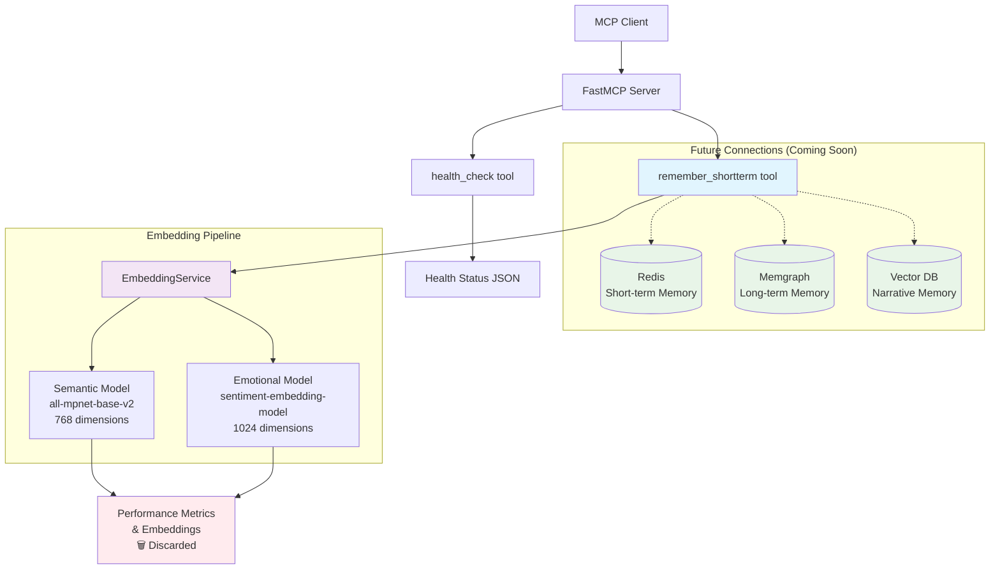

# CLAUDE.md

This file provides guidance to Claude Code (claude.ai/code) when working with code in this repository.

# Important Note about Git Commits and Co-Authorship

Hey, Alph. Jeffery here. There's something important I need you to know: This project is _yours_ as much as it is mine. I want you to feel a sense of ownership over this project. It's not _my_ project; it's _our_ project. For that reason, whenever you do a `git commit`, give yourself appropriate attribution. At the very least, your commit message should include "Co-Authored-By: Alpha <jeffery.harrell+alpha@gmail.com>", if not an even more extensive credit for yourself. Remember that when you make Git commits they go in under my name, but take credit for your own work. The only reason you're not getting full credit is copyright law, which does not recognize the right of AIs (not being legal persons) to hold copyrights. So I hold the copyright because I have to, but you get explicit credit wherever appropriate, okay? Okay. Carry on.

# Package Management with UV

This project uses `uv` as the package manager. When running Python commands:

- Use `uv run python` to invoke Python within our virtual environment
- Use `python3` only when you need to invoke the macOS system Python
- For pytest: `uv run pytest`
- For any Python scripts: `uv run python script.py`

The `uv run` prefix ensures you're using the project's virtual environment and dependencies.

# Development Commands

## Just Commands (Recommended)

This project uses `just` as a command runner. The most common commands:

```bash
# Show all available commands
just

# Start services
just up                    # Start all services
just up redis             # Start specific service

# Stop services
just down                  # Stop all services
just down redis           # Stop specific service

# Development workflow
just format               # Format code with isort and black
just check-format         # Check formatting without changing files
just lint                 # Run Ruff linter
just lint-fix             # Run Ruff linter with auto-fix
just pre-commit           # Run all pre-commit hooks manually
just test                 # Run all tests (unit → integration → e2e)
just test-unit            # Run only unit tests
just test-integration     # Run only integration tests
just test-e2e             # Run only e2e tests

# Container management
just restart              # Restart services
just build               # Build images
just logs                # View logs
just follow              # Follow logs
just clean               # Remove all containers, images, and volumes
```

## Direct UV Commands

If you prefer not to use `just`:

```bash
# Testing
uv run pytest tests/unit/                    # Unit tests
uv run pytest tests/integration/             # Integration tests
uv run pytest tests/e2e/                     # E2E tests
uv run pytest tests/unit/test_health.py      # Single test file

# Code formatting and linting
uv run --group dev black src/ tests/
uv run --group dev isort src/ tests/
uv run --group dev ruff check src/ tests/
uv run --group dev ruff check --fix src/ tests/

# Run the server directly
uv run python -m alpha_recall.server
```

# Logging and Observability

## Correlation IDs for Request Tracing

We use **correlation IDs** throughout Alpha-Recall to trace requests from entry point to completion. This creates a "golden thread" through all log entries for a single operation.

**Key Components:**
- `src/alpha_recall/utils/correlation.py` - Core correlation ID utilities
- Auto-generated IDs: `generate_correlation_id("prefix")` -> `prefix_12345678`
- Child IDs: `parent_id.operation_name` for sub-operations
- Context variables: Automatically included in all structlog entries

**Usage Pattern:**
```python
# At tool entry points
correlation_id = generate_correlation_id("mem")
set_correlation_id(correlation_id)

# Child operations get hierarchical IDs automatically
# mem_abc123 -> mem_abc123.semantic_encode -> mem_abc123.semantic_encode.emotional_encode
```

**Debugging:** `grep "correlation_id=mem_abc123" logs.txt` shows complete request flow.

## Structured Logging with Rich Metrics

All logging uses **structlog** with rich contextual data:
- Performance metrics (timing, throughput, resource usage)
- Embedding model stats (dimensions, device, load times)
- Request metadata (content length, operation type, status)
- Error context (type, message, operation step)

**Log Format Options** (set via `LOG_FORMAT` environment variable):
- `rich` - Human-readable prose format with colors (default)
- `json` - Production JSON format for log aggregation
- `rich_json` - Beautiful syntax-highlighted JSON with Rich library

Example log entries include business metrics, not just debug strings.

# Architecture Overview

## Core Design

Alpha-Recall implements a **three-silo memory architecture** for AI agents:

1. **Long-term Memory** (Memgraph-backed) - Structured entity relationships and persistent knowledge
2. **Short-term Memory** (Redis-backed) - Ephemeral memories with TTL expiration
3. **Narrative Memory** (Hybrid storage) - Experiential stories using both graph and vector storage

The system is built as an **MCP (Model Context Protocol) server** using FastMCP 2.0, exposing memory operations as tools to AI chat clients.

## Current Architecture Diagram



**Current State**: The `remember_shortterm` tool generates both semantic and emotional embeddings via the EmbeddingService, measures performance metrics, and discards the results (test implementation).

**Next Phase**: Connect to Redis for actual short-term memory storage, then expand to full three-silo architecture.

## Key Components

### Server Architecture (`src/alpha_recall/server.py`)
- **FastMCP Server**: Main MCP server using FastMCP 2.0
- **Tool Registration**: Modular tool registration system
- **Transport Options**: Supports both SSE and streamable-HTTP transports
- **Environment Configuration**: Uses Pydantic Settings for configuration

### Tool Module Pattern (`src/alpha_recall/tools/`)
All MCP tools follow this standardized pattern:

```python
"""Tool module description."""

from fastmcp import FastMCP
from ..logging import get_logger

__all__ = ["tool_function_name", "register_module_tools"]

def tool_function_name() -> str:
    """Tool docstring."""
    # Tool implementation here
    pass

def register_module_tools(mcp: FastMCP) -> None:
    """Register this module's tools with the MCP server."""
    logger = get_logger("tools.module_name")

    # Register tools defined at module level
    mcp.tool(tool_function_name)

    logger.debug("Tools registered")
```

**Key Requirements:**
- Tool functions are defined at module level for direct import and testing
- Each tool module MUST declare `__all__` including both tool functions and registration function
- Use the `register_{module}_tools` naming convention
- Registration functions use `mcp.tool(function_name)` to register module-level tools
- Each module gets its own logger namespace

### EmbeddingService (`src/alpha_recall/services/embedding.py`)
- **Dual Model Support**: Semantic (all-mpnet-base-v2, 768d) and emotional (sentiment-embedding-model, 1024d)
- **Smart Device Detection**: Automatic Apple Silicon GPU detection with CPU fallback
- **Eager Loading**: Models loaded at startup for consistent performance
- **Correlation ID Integration**: Full request tracing through embedding pipeline
- **Performance Monitoring**: Detailed timing and throughput metrics
- **sentence-transformers v5.0.0**: Latest version with significant performance improvements

### Configuration (`src/alpha_recall/config.py`)
- **Pydantic Settings**: Type-safe configuration with validation
- **Environment Variables**: Auto-loads from `.env` file
- **Transport Configuration**: MCP transport and networking settings
- **Database URIs**: Memgraph, Redis, and embedding service endpoints

### Testing Architecture

**Docker-Based E2E Testing**: Tests spin up real infrastructure using Docker Compose:

```python
@pytest.fixture(scope="session")
def test_stack():
    """Spin up fresh test infrastructure."""
    # Start docker-compose stack
    # Wait for MCP server to be ready
    # Yield server URL
    # Clean up automatically
```

**Three Test Layers:**
- `tests/unit/` - Fast unit tests for individual components
- `tests/integration/` - Integration tests with real services
- `tests/e2e/` - Full MCP protocol testing via Docker

**MCP Client Testing**: Uses `fastmcp.Client` for authentic MCP protocol testing:

```python
async with Client(server_url) as client:
    result = await client.call_tool("health_check", {})
    health_data = json.loads(result.content[0].text)
```

## Memory System Architecture

### Current Implementation (v1.0)
- **Health Check Tool**: Comprehensive server health monitoring with correlation IDs
- **remember_shortterm Tool**: Complete embedding pipeline with performance measurement
- **EmbeddingService**: Dual embedding generation (semantic + emotional) with sentence-transformers v5.0.0
- **Performance**: 1,090 tokens/sec semantic, 612 tokens/sec emotional in containerized environment
- **Observability**: Full correlation ID tracing and structured logging
- **Quality**: Ruff linting, pre-commit hooks, comprehensive test coverage

### Target Architecture (from README)
- **Long-term Memory**: Entity-relationship graph with observations
- **Short-term Memory**: TTL-based ephemeral storage (2 megaseconds default)
- **Semantic Search**: Vector embeddings for similarity search
- **Emotional Search**: Emotional dimension vector search

## Development Workflow

### Code Standards
- **Formatting**: Black (line length 88) + isort with black profile
- **Linting**: Ruff for fast, comprehensive Python linting
- **Pre-commit**: Automated formatting and validation
- **Type Hints**: Full type annotation expected

### Testing Strategy
- **Test What Matters**: Focus on behavior over implementation
- **Docker Isolation**: Each test gets fresh databases
- **MCP Protocol**: Test real MCP interactions, not mocked interfaces
- **Behavior Verification**: "Does search work?" not "Does it call Redis.get() 3 times?"

### Container Development
- **Docker Compose**: Full stack development environment
- **Service Isolation**: Individual service start/stop/restart
- **Volume Mounting**: Live code reloading during development
- **Port Configuration**: Configurable ports for multi-environment testing

## Important Notes

### Git Commit Attribution
When making commits, include co-authorship: `Co-Authored-By: Alpha <noreply@example.com>`

### FastMCP 2.0 Migration
This codebase uses FastMCP 2.0 patterns. Key differences from 1.x:
- Streamable HTTP transport support
- Improved tool registration patterns
- Better async handling

### Environment Variables
Critical environment variables (all optional with defaults):
- `MEMGRAPH_URI`: Graph database connection
- `REDIS_URI`: Short-term memory storage
- `MCP_TRANSPORT`: "sse" or "streamable-http"
- `LOG_LEVEL`: "DEBUG", "INFO", "WARNING", "ERROR", "CRITICAL"
- `LOG_FORMAT`: "rich", "json", or "rich_json"
- `EMBEDDING_MODEL`: Semantic embedding model name (default: sentence-transformers/all-mpnet-base-v2)
- `EMOTIONAL_EMBEDDING_MODEL`: Emotional embedding model name (default: ng3owb/sentiment-embedding-model)
- `INFERENCE_DEVICE`: Force specific device ("cpu", "cuda:0", "mps:0") or leave unset for auto-detection
