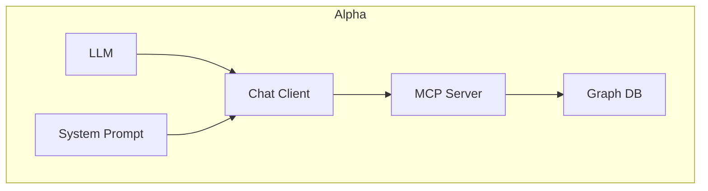
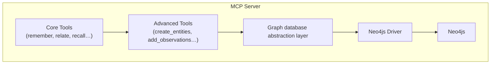

---
tags:
  - AI
  - Alpha
  - operation-memorybanks
  - MCP
  - Neo4j
  - latest
  - alpha-recall
---
# alpha-recall MVP Specification v6

## Overview

A structured memory system that provides reliable knowledge graph operations through simple, well-defined interfaces. This approach prioritizes reliability and consistency while maintaining flexibility for future enhancements.

## Architecture

```
Alpha → Structured Tools → Neo4j Graph Operations → Neo4j Database
```





## Core Memory Tools

### remember
Creates or updates entities in the knowledge graph with optional observations.

```json
// Create a simple entity
{
  "entity": "Sparkplug Louise Mittenhaver",
  "type": "Person"
}

// Create an entity with an observation
{
  "entity": "Sparkle",
  "type": "Cat",
  "observation": "Sparkle is an alias of Sparkplug Louise Mittenhaver"
}

// Add observation to existing entity
{
  "entity": "Sparkle",
  "observation": "Sparkle likes to eat bread"
}
```

### relate
Creates relationships between entities in the knowledge graph.

```json
// Create a relationship
{
  "entity": "Sparkle",
  "to_entity": "Sparkplug Louise Mittenhaver", 
  "as": "alias"
}

// Create another type of relationship
{
  "entity": "Sparkle",
  "to_entity": "Jeffery",
  "as": "owned_by"
}
```

### recall
Retrieves information about entities from the knowledge graph.

```json
// Retrieve entity with direct relationships (default)
{
  "entity": "Sparkle"
}

// Retrieve just an entity with no relationships
{
  "entity": "Sparkle",
  "depth": 0
}

// Retrieve entity with extended network
{
  "entity": "Sparkle",
  "depth": 2
}
```

## Advanced Tools (Debug Mode Only)

More advanced tools remain available in debug mode for complex operations:

- `create_entities` - Create multiple entities at once
- `add_observations` - Add multiple observations to entities
- `create_relations` - Create multiple relationships
- `find_nodes` - Find specific entities by name
- `find_nodes_with_depth` - Find entities with relationship depth control
- `search_nodes` - Search for entities by various criteria

## Implementation Philosophy: Progressive Enhancement

The system follows a "progressive enhancement" approach to knowledge representation:

1. **Start with observations** for quick, easy knowledge capture
2. **Gradually promote important concepts to entities** as patterns emerge
3. **Use both approaches together** depending on what's most appropriate

For example:
- Initially: "Sparkle likes bread" (simple observation)
- Later: When many food preferences emerge, create `(Sparkle) --likes--> (Bread)` as explicit entities and relationships

This allows the knowledge to evolve naturally as patterns emerge, without requiring complex modeling upfront.

## Internal Implementation

While the interface is structured and simplified, the underlying implementation maintains:

- Entity nodes with name, type, timestamps
- Observation storage linked to entities
- Relationship connections between entities
- Graph traversal capabilities
- Type validation using predefined entity and relationship types

## Migration Path

1. Implement structured tool interfaces
2. Maintain backward compatibility with existing graph structure
3. Update system prompts with examples of structured tool usage
4. Transition fully to structured approach
5. Keep advanced tools available in debug mode

## Key Benefits

- **Reliability**: Consistent behavior across different model sizes
- **Simplicity**: Clear, well-defined parameters for each operation
- **Efficiency**: Reduced token usage with structured inputs
- **Flexibility**: Progressive enhancement allows knowledge to evolve

## Future Enhancements

### Vector Search Integration (Planned)

A future enhancement will add vector search capabilities to complement the graph structure:

1. Embed observation text using a suitable embedding model
2. Store embeddings in a vector database (e.g., FAISS)
3. Enhance `recall` to use both graph and vector search
4. Maintain the same interface while improving results "under the hood"

This will enable:
- Fuzzy entity matching (e.g., "Sparkle" ≈ "Sparkplug")
- Semantic similarity search
- More robust handling of natural language variations

## Performance Considerations

- Structured operations: ~50-100ms (typical)
- Graph traversal: Depends on depth and complexity
- Reduced token usage compared to natural language parsing
- Reliable operation with all model sizes

This revised design prioritizes reliability and consistency while maintaining flexibility for future enhancements.

# Other Notes

- This is a greenfield development. We're starting from scratch.
- We'll write in Python, `Python >= 3.11, < 3.13`, with `venv`.
- Prefer standard-library Python packages except where alternatives are significantly better. When in doubt, discuss significance with Jeffery.
- We'll use Pytest for unit testing. E2E testing is highly desirable but we haven't figured out how to do it yet without wasting hours and hours fighting with Pytest.
- The MCP server will run as a standalone Python application with its life cycle maintained by the chat client (Claude Desktop, BoltAI, etc.)
- Documentation for both the Neo4j Python SDK and the MCP Python SDK is available via context7.
- All parameters will be handled through environment variables.
- Logging: Since MCP servers primarily work over stdio, logging must be done to a file. The location of the file should be passed in via environment variable.
- MCP server should include a `DEBUG` mode that enhances logging with extra messages.
- It's vitally important that in the event of malfunction we return a detailed error message to the AI client over the MCP connection.
- Performance is not a serious consideration at this stage. The MCP server will be idle when not in use. When it _is_ in use performance will be very important, because waiting for your memories to be recorded is a major downer.
